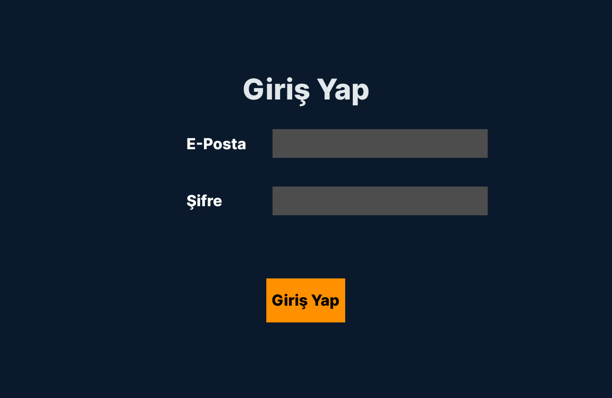

# ConfessionBox
It is a project on visual programming lecture.

# DB Scheme

| **Users** | **Confessions** | **Confessions_Categorye** |
|-----------------|-----------------|-----------------|
| id             | id             | id             |
| fullname       | user_id        | text           |
| email          | category_id    |                |
| created_date   | text           |                |
| gender         | created_date   |                |

# UI/UX

| **Auth** | **Login** | **Register** |
|-----------------|-----------------|-----------------|
|              |               |               |

| **Open Confessions** | **Close Confessions** | **Profile** |
|-----------------|-----------------|-----------------|
|              |               |               |
